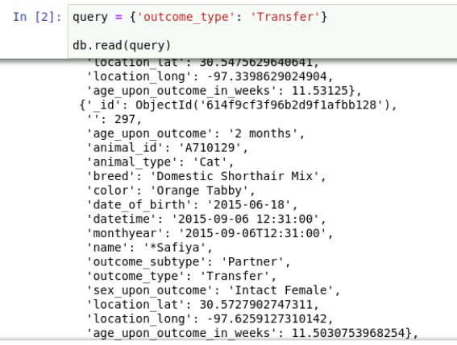
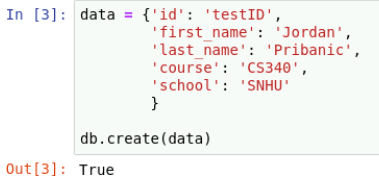
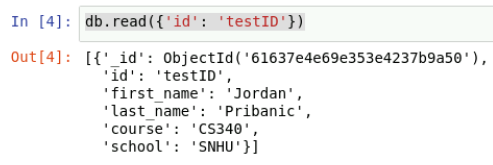
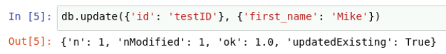
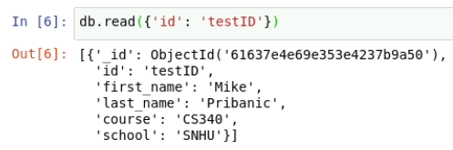
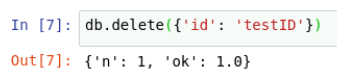
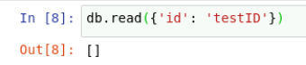

# About the Project
The purpose of this project is to provide a way to connect to a local MongoDB
server using Python 3 and the ability to perform basic CRUD functionality on 
the database. This includes Creating a new entry for the database, Reading the 
contents of the database by supporting the use of queries for detailed 
searches, Updating entries in the database, and Deleting entries in the 
database based on the given parameters.<br/><br/><br/>


# Motivation
The purpose of this project is to provide an easy to way to connect to a 
MongoDB server with Python 3, and interact with the data using minimal code to 
make implementing MongoDB into any project as simple as possible.<br/><br/><br/>

# Getting Started
To get up and running, download the files included and place the 
‘animal_shelter.py’ file into the same directory as the Python file you will be 
using to access the database. Then, simply import the class into your file:<br/><br/>

```python
import animal_shelter
```

Now you are ready to connect to the MongoDB server on your machine.<br/><br/><br/>

# Installation
### Additional dependencies include: 

<br/>&nbsp;&nbsp;&nbsp;&nbsp; <strong>PyMongo</strong><br/><br/>
&nbsp;&nbsp;&nbsp;&nbsp; To install pymongo using pip, do the following:

```
pip install pymongo
```

<br/>&nbsp;&nbsp;&nbsp;&nbsp; <strong>BSON</strong><br/><br/>
&nbsp;&nbsp;&nbsp;&nbsp; To install bson using pip, do the following:

```
pip install bson
```

<br/><br/>
# Usage
To start using, first you must open ‘animal_shelter.py’ and provide the username 
and password for the database being connected to, as well as the port number of 
your local MongoDB server connection. This can be done in this line:<br/>

```python
self.client = MongoClient('mongodb://%s:%s@localhost:YOUR_PORT_NUMBER' % (username, password))
```

The username and password can be supplied during initialization or hard coded if 
desired. Replace YOUR_PORT_NUMBER with the port of your server connection. Once the 
above step is complete, you can then create the connection object with the 
following code:<br/><br/>

```python
db = animal_shelter.AnimalShelter('username', 'password')
```
## Creating
To create entries for the database, it is as simple as using this object to access the 
create method. This methods expects the data to be in a Python dictionary as key-value pairs.

```python
db.create({'key': 'value'})
```

## Reading
The read method works in the same way as the create method. This method also expects a 
Python dictionary as a parameter. An empty dictionary can be used to read all contents, 
or a query can be made to filter the results as shown below. It will return True if 
create was a success, otherwise it will return False.

```python
db.read({})
db.read({'key': 'value'})
```

## Updating
The update method works just like creating and reading, but will accept two parameters 
instead of one. The first is the search criteria, and the second is the data you wish 
to change or add to the entry. This will return the status of the update provided by 
MongoDB. 

```python
db.update({'search_key': 'search_value'}, {'new_key': 'new_value'})
```

## Deleting
Deleting is just as simple as the other CRUD operations. This method will take only 
the search criteria in the form of a Python dictionary just as the read method 
does, except instead of searching, it will delete any matches. 

```python
db.delete({'key': 'value'})
```
<br/><br/>

# Tests
### Reading entries with outcome type of 'Transfer'
<br/><br/>

### Creating a new entry
<br/><br/>

### Searching for newly created entry
<br/><br/>

### Updating first name of new entry
<br/><br/>

### Confirming success of update
<br/><br/>

### Deleting new entry
<br/><br/>

### Confirming entry has been deleted
<br/><br/><br/>

# Grazioso Salvare Dashboard
Below is a web-based dashboard created using the CRUD module to access the 
animal shelter database. This dashboard was created using Python 3, MongoDB, 
Dash, Jupyter Notebook and Plotly. MongoDB was chosen for its fast performance 
and ease of use, especially when combining it with Python. Python was used in 
this project for the reasons above, as well as it's ability to create web 
applications in a quick and simple process. Although Python also supports Flask 
and Django, for the purpose of this project Dash was the perfect match to get 
the contents from the Mongo database up and running in an easy to use dashboard.
Plotly was used to supply the interactive map and the data visualization. Lastly,
Jupyter Notebook was an easy choice for development since it is already running 
on the local server. Because of this, development was made exponentially easier 
with the ability to quickly test the dashboard while it was being created right 
in the web browser. One of the biggest challenges faced while working on this project 
was implementing the data visualization. After reading through the documentation 
and some other resources, it became clear how to implement the perfect graph for
the needs of the project.

<p align="center">
    
</p><br/><br/>

<p align="center">
    
</p><br/><br/>

<p align="center">
    
</p><br/><br/>

<p align="center">
    
</p><br/><br/>
